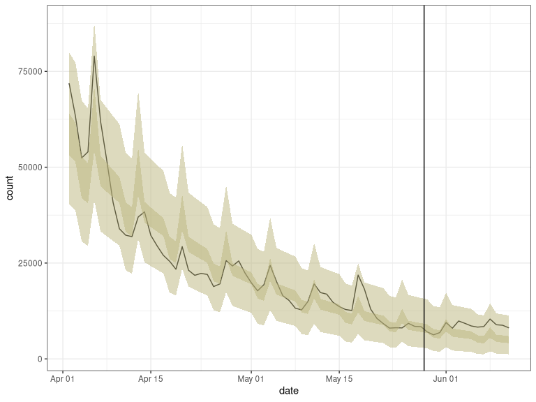

<!-- README.md is generated from README.Rmd. Please edit that file -->

<!-- badges: start -->

[](https://CRAN.R-project.org/package=trendeval)
[](https://codecov.io/gh/reconverse/trendeval?branch=master)
[](https://github.com/reconverse/trendeval/actions)
<!-- badges: end -->

# Trendeval

*trendeval* aims to provide a coherent interface for evaluating models
fit with the [trending](https://github.com/reconverse/trending) package.
Whilst it is useful in an interactive context, it’s main focus is to
provide an intuitive interface on which other packages can be developed
(e.g. [*trendbreaker*](https://github.com/reconhub/trendbreaker)).

## Installing the package

You can install the stable version of this package from
[CRAN](https://CRAN.R-project.org) with:

``` r
install.packages("trendeval")
```

The development version can be installed from
[GitHub](https://github.com/) with:

``` r
if (!require(remotes)) {
  install.packages("remotes")
}
remotes::install_github("reconverse/trendeval", build_vignettes = TRUE)
```

## Model selection example

``` r
library(dplyr)      # for data manipulation
library(outbreaks)  # for data
library(trending)   # for trend fitting
library(trendeval)  # for model selection

# load data
data(covid19_england_nhscalls_2020)

# define a selection of model in a named list
models  <- list(
  simple = lm_model(count ~ day),
  glm_poisson = glm_model(count ~ day, family = "poisson"),
  glm_poisson_weekday = glm_model(count ~ day + weekday, family = "quasipoisson"),
  glm_quasipoisson = glm_model(count ~ day, family = "poisson"),
  glm_quasipoisson_weekday = glm_model(count ~ day + weekday, family = "quasipoisson"),
  glm_negbin = glm_nb_model(count ~ day),
  glm_negbin_weekday = glm_nb_model(count ~ day + weekday),
  will_error = glm_nb_model(count ~ day + nonexistant)
)

# select 8 weeks of data (from a period when the prevalence was decreasing)
last_date <- as.Date("2020-05-28")
first_date <- last_date - 8*7
pathways_recent <-
  covid19_england_nhscalls_2020 %>%
  filter(date >= first_date, date <= last_date) %>%
  group_by(date, day, weekday) %>%
  summarise(count = sum(count), .groups = "drop")

# split data for fitting and prediction
dat <-
  pathways_recent %>%
  group_by(date <= first_date + 6*7) %>%
  group_split()
fitting_data <- dat[[2]]
pred_data <- select(dat[[1]], date, day, weekday)

# assess the models using the evaluate_resampling and a variety of metrics
results <- evaluate_models(
  models,
  fitting_data, 
  method = evaluate_resampling,
  metrics = list(yardstick::rmse, yardstick::huber_loss, yardstick::mae)
)

results
#> # A tibble: 8 x 8
#>   model_name       model    data        warning   error   huber_loss   mae  rmse
#>   <chr>            <named > <list>      <named l> <named>      <dbl> <dbl> <dbl>
#> 1 simple           <trndng… <tibble [4… <NULL>    <NULL>       6902. 6903. 6903.
#> 2 glm_poisson      <trndng… <tibble [4… <chr [43… <NULL>       5193. 5193. 5193.
#> 3 glm_poisson_wee… <trndng… <tibble [4… <chr [1]> <chr […        NA    NA    NA 
#> 4 glm_quasipoisson <trndng… <tibble [4… <chr [43… <NULL>       5193. 5193. 5193.
#> 5 glm_quasipoisso… <trndng… <tibble [4… <chr [1]> <chr […        NA    NA    NA 
#> 6 glm_negbin       <trndng… <tibble [4… <NULL>    <NULL>       5238. 5238. 5238.
#> 7 glm_negbin_week… <trndng… <tibble [4… <NULL>    <chr […        NA    NA    NA 
#> 8 will_error       <trndng… <tibble [4… <NULL>    <chr […        NA    NA    NA
```

### Example of how this output could then be used

``` r
library(tidyr)      # for data manipulation
library(purrr)      # for data manipulation
library(ggplot2)    # for plotting

# Pull out the model with the lowest RMSE
best_by_rmse <- 
    results %>% 
    filter(map_lgl(warning, is.null)) %>%  # remove models that gave warnings
    filter(map_lgl(error, is.null))  %>%   # remove models that errored
    slice_min(rmse) %>% 
    select(model) %>% 
    pluck(1,1)

best_by_rmse
#> $model_class
#> [1] "MASS::glm.nb"
#> 
#> $fit
#> function(data) {
#>         model <- MASS::glm.nb(formula = .(formula), data = data, ...)
#>         model_fit(model, data)
#>       }
#> <environment: 0x7de70c0>
#> 
#> attr(,"class")
#> [1] "trending_glm_nb" "trending_model"

# Now let's look at the following 14 days as well
new_dat <-
  covid19_england_nhscalls_2020 %>% 
  filter(date > "2020-05-28", date <= "2020-06-11") %>% 
  group_by(date, day, weekday) %>%
  summarise(count = sum(count), .groups = "drop")

all_dat <- bind_rows(pathways_recent, new_dat)

out <- 
  best_by_rmse %>%  
  fit(pathways_recent) %>% 
  predict(all_dat) %>%  
  as_tibble()

out
#> # A tibble: 71 x 9
#>    date         day weekday   count estimate lower_ci upper_ci lower_pi upper_pi
#>    <date>     <int> <fct>     <int>    <dbl>    <dbl>    <dbl>    <dbl>    <dbl>
#>  1 2020-04-02    15 rest_of_… 71917   54614.   49046.   60813.    33412    80753
#>  2 2020-04-03    16 rest_of_… 63365   52856.   47603.   58689.    33201    76164
#>  3 2020-04-04    17 weekend   52412   51155.   46200.   56641.    32670    73787
#>  4 2020-04-05    18 weekend   54014   49509.   44838.   54666.    31608    71643
#>  5 2020-04-06    19 monday    78996   47915.   43515.   52761.    29932    69786
#>  6 2020-04-07    20 rest_of_… 62026   46373.   42229.   50925.    29923    69140
#>  7 2020-04-08    21 rest_of_… 51692   44881.   40979.   49155.    28976    65417
#>  8 2020-04-09    22 rest_of_… 40797   43437.   39765.   47448.    27354    64013
#>  9 2020-04-10    23 rest_of_… 33946   42039.   38585.   45802.    26546    60591
#> 10 2020-04-11    24 weekend   32269   40686.   37437.   44216.    25768    58520
#> # … with 61 more rows

# plot output
ggplot(out, aes(x = date, y = count)) +
  geom_line() +
  geom_ribbon(mapping = aes(x = date, ymin = lower_ci, ymax = upper_ci),
              data = out, alpha = 0.5, fill = "#BBB67E") +
  geom_ribbon(mapping = aes(x = date, ymin = lower_pi, ymax = upper_pi),
              data = out, alpha = 0.5, fill = "#BBB67E") +
  geom_vline(xintercept = as.Date("2020-05-28") + 0.5) +
  theme_bw()
```



# Resources

## Getting help online

Bug reports and feature requests should be posted on *github* using the
[*issue* system](https://github.com/reconverse/trendeval/issues). All
other questions should be posted on the **RECON** slack channel see
<https://www.repidemicsconsortium.org/forum/> for details on how to
join.
